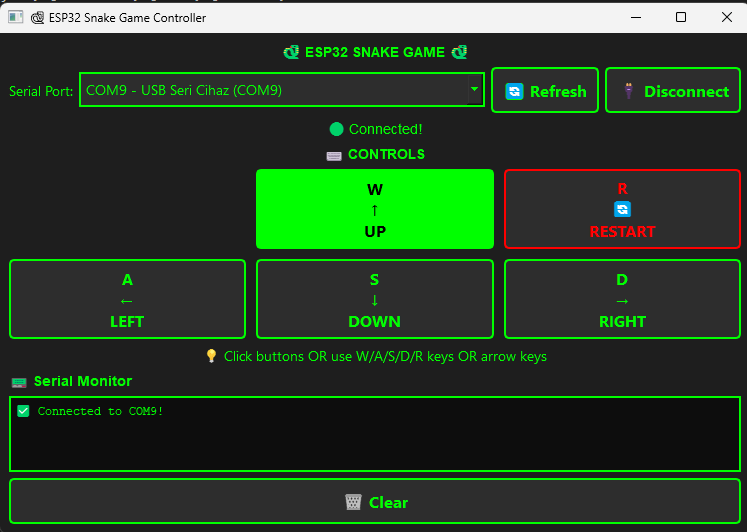

# 🐍 ESP32 Snake Game

<div align="center">


[](https://www.arduino.cc/)
[](https://www.espressif.com/)
[](https://www.python.org/)
[](https://www.qt.io/)

**Classic Snake game on ESP32-S3 with ILI9341 TFT display**

[Features](#features) • [Hardware](#hardware) • [Installation](#installation) • [Usage](#usage) • [Contributing](#contributing)

</div>

---

## ✨ Features

- 🎮 **Classic Snake Gameplay** - Smooth movement and collision detection
- 🖥️ **TFT Display Graphics** - Colorful 320x240 display
- 🐍 **Growing Snake** - Eat food to grow and increase difficulty
- ⚡ **Speed Progression** - Game gets faster as you score
- 📟 **Serial Control** - Control via Serial Monitor or Python GUI
- 🎨 **Python GUI Controller** - Beautiful desktop interface with PySide6
- ⌨️ **Multiple Input Methods** - WASD, Arrow keys, or GUI buttons

## 🎬 Demo

### Gameplay


### Python Controller


## 🛠️ Hardware

### Required Components

| Component | Specification |
|-----------|---------------|
| **Microcontroller** | ESP32-S3 (Goouuu expansion board) |
| **Display** | 2.8" ILI9341 TFT (320x240) |
| **Connection** | SPI interface |

### Pin Configuration
```
TFT Display Pins:
├─ VCC    → 3.3V
├─ GND    → GND
├─ CS     → GPIO 14
├─ RESET  → GPIO 21
├─ DC     → GPIO 47
├─ MOSI   → GPIO 45
├─ SCK    → GPIO 3
├─ LED    → GPIO 48 (Backlight)
└─ MISO   → GPIO 46
```

## 📦 Installation

### 1. Arduino Setup

#### Install Required Libraries
```bash
# In Arduino IDE:
Sketch → Include Library → Manage Libraries

# Search and install:
- LovyanGFX
```

#### Upload Code
1. Open `serial-version/arduino/snake_game_serial/snake_game_serial.ino`
2. Select board: `ESP32S3 Dev Module`
3. Configure settings:
   - USB CDC On Boot: `Enabled`
   - Upload Speed: `115200`
4. Upload to ESP32

### 2. Python Controller Setup

#### Install Python Dependencies
```bash
cd serial-version/python-controller
pip install -r requirements.txt
```

#### Run Controller
```bash
python snake_controller.py
```

## 🎮 Usage

### Method 1: Serial Monitor
1. Open Arduino Serial Monitor (115200 baud)
2. Press any key to start
3. Use **W/A/S/D** keys to control
4. Press **R** to restart

### Method 2: Python GUI Controller
1. Run `python snake_controller.py`
2. Select COM port
3. Click **Connect**
4. Use GUI buttons, keyboard (WASD), or arrow keys

### Controls

| Key | Action |
|-----|--------|
| **W** / **↑** | Move Up |
| **A** / **←** | Move Left |
| **S** / **↓** | Move Down |
| **D** / **→** | Move Right |
| **R** | Restart Game |

## 🎯 Game Rules

1. 🐍 Control the snake to eat red food
2. 🍎 Each food increases score by 10 points
3. ⚡ Speed increases with each food
4. 💀 Avoid hitting walls and yourself
5. 🏆 Try to beat your high score!

## 📊 Technical Details

- **Display Resolution**: 320x240 pixels
- **Grid Size**: 10x10 pixels per cell
- **Initial Speed**: 150ms per frame
- **Speed Increment**: -10ms per food (min 30ms)
- **Max Snake Length**: 200 segments

## 🙏 Acknowledgments

- [LovyanGFX](https://github.com/lovyan03/LovyanGFX) - Excellent graphics library
- [PySide6](https://www.qt.io/qt-for-python) - Python Qt bindings
- Classic Snake game for inspiration


---

<div align="center">

**Enjoy**

</div>